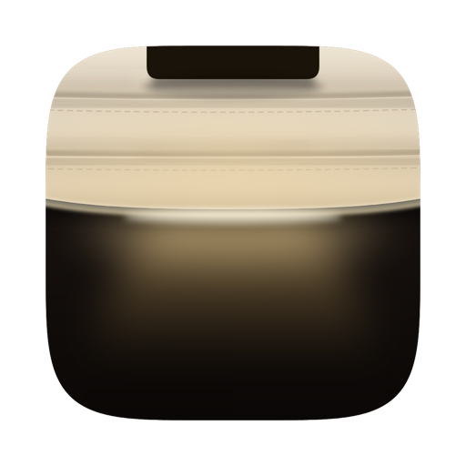
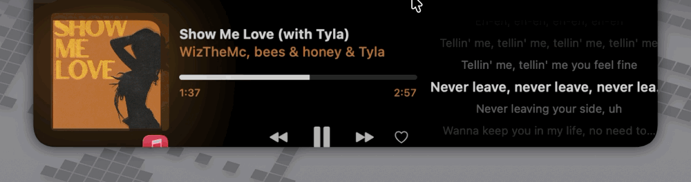
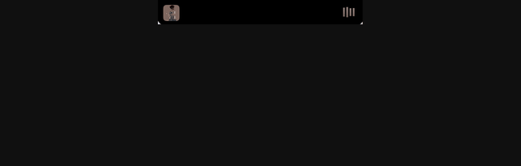

<div align="center">



# Notch Lyrics

**Letras sincronizadas, el tiempo y un bloc de notas — todo en el notch de tu MacBook.**

Un fork de [Boring Notch](https://github.com/TheBoredTeam/boring.notch) que añade un
panel de letras de verdad, una pestaña del tiempo y una nota rápida que se guarda
directamente en Notas de Apple.

> **Esta es una versión modificada de Boring Notch.** Un fork independiente,
> modificado desde el **6 de octubre de 2026**. Sin afiliación ni respaldo de
> The Bored Team. Publicado bajo GPL-3.0; los cambios se detallan en [NOTICE](NOTICE).

[English](README.md) | [简体中文](README.zh-CN.md) | Español

<!-- Insignias -->
[](LICENSE)
[](#requisitos)
[](https://github.com/TheBoredTeam/boring.notch)
[](https://github.com/huo241/notch-lyrics/releases)
[](https://github.com/huo241/notch-lyrics/releases)
[](https://github.com/huo241/notch-lyrics/stargazers)
[](https://github.com/huo241/notch-lyrics/issues)

<!-- Botones rápidos -->
[](https://github.com/huo241/notch-lyrics/releases/latest)
[](https://github.com/huo241/notch-lyrics/stargazers)
[](https://github.com/huo241/notch-lyrics/issues)
[](https://github.com/TheBoredTeam/boring.notch)

</div>

---

## Novedades de la 1.0

Esta es la versión en la que el fork dejó de ser un fork. El nombre original
desaparece del proyecto, del bundle ID, del helper XPC y de la CI; la búsqueda de
letras se reconstruyó en lugar de parchearse; y el canal de actualizaciones es
ahora el de este repositorio.
Notas completas: [`docs/releases/1.0.0.md`](docs/releases/1.0.0.md).

| | |
|---|---|
| 🪪 **Identidad propia** | Proyecto, targets, esquema, bundle ID y helper XPC renombrados; toda referencia al proyecto original eliminada de la CI, incluido el trabajo que publicaba en su tap de Homebrew. |
| 🔍 **Letras que nunca faltaban** | El endpoint de coincidencia exacta de LRCLIB solo tolera **dos segundos** de diferencia en la duración. Ahora se prueba sin duración y después con una búsqueda puntuada localmente, quitando antes el ruido entre paréntesis y los sufijos tras el guion. |
| 🎯 **Sin coincidencias equivocadas** | Los resultados se puntúan contra la pista que suena y todo lo que no llega al umbral se descarta: mejor nada que la canción equivocada. |
| ▶️ **La línea activa se rellena mientras suena** | La letra actual pasa de tenue a brillante a lo largo de su propia duración, medida sobre el ancho real del texto. |
| ✍️ **Notas rápidas: Notas u Obsidian** | El panel de notas elige su destino y el vault elegido se recuerda como bookmark con ámbito de seguridad, sin nuevos entitlements. |
| 🔄 **Canal de actualizaciones propio** | Sparkle consulta el feed de este repositorio y lo verifica con una clave generada para este proyecto. |
| 🏷️ **Un interruptor que mentía** | El interruptor de letras decía *"below artist name"*, una ubicación que ya no existe: controla el panel a la derecha del notch abierto. Renombrado, y el catálogo en chino ya tiene traducción real. |

### Heredado de la 2.8.0 original

Todo lo de abajo viene del proyecto original y este fork no lo ha tocado; se
enumera aquí porque la 1.0 es la primera versión que publica este repositorio.

| | |
|---|---|
| 🌤️ **Pestaña del tiempo** | Condiciones actuales, curva de temperatura por horas con precipitación y previsión a 7 días. Datos de [Open-Meteo](https://open-meteo.com), **sin clave de API**; busca cualquier ciudad en cualquier idioma o deja que la ubicación por IP lo haga. |
| ✍️ **Nota rápida** | Un bloc dentro del notch con barra de formato. Pulsa Intro y la nota cae en la carpeta de Notas de Apple que elijas. |
| 🎵 **El estado de reproducción se cura solo** | Tras dormir o un rato largo sin tocar nada, el panel se quedaba congelado en la pista anterior: la música sonaba, pero el icono y las letras no se movían. Ahora vuelve a leer el estado por su cuenta. |
| ⏱️ **AppleScript tiene límite de tiempo** | Un solo Apple Event que nunca respondía bloqueaba para siempre la cola serial de scripts, y con ella todo el panel. Ahora los scripts se rinden a los 5 segundos. |
| 🪟 **Se acabó la sombra del notch** | Eliminada por completo, junto con su ajuste. La sombra se componía fuera de pantalla en cada fotograma, y eso la hacía parpadear contra el cielo animado. |

## Tres pestañas, un notch

La misma caja, el mismo tamaño, sin sorpresas de diseño: el notch es una superficie
compartida y cada pestaña es una cara distinta.

| Pestaña | Qué es |
|---|---|
| 🎵 **Letras** | Reproductor a la izquierda, ventana de 5 líneas desplazándose a la derecha |
| 🌤️ **Tiempo** | El cielo, dibujado en el notch, con curva horaria y franja semanal |
| ✍️ **Nota rápida** | Un bloc que escribe en Notas de Apple |

### 🎵 Letras que de verdad se desplazan

Boring Notch ya tenía un interruptor de letras, pero **solo mostraba una línea
de texto**: los datos de sincronización se descartaban antes de llegar a la
pantalla. Activarlo te daba una línea estática que cambiaba de texto mientras
sonaba la canción.

Este fork arregla tanto el flujo de datos como la presentación:

| | Original | Este fork |
|---|---|---|
| Visualización | Una línea, sin desplazamiento | **Ventana de 5 líneas con desplazamiento y línea actual resaltada** |
| Sincronización | Descartada | **Marcas de tiempo LRC desde LRCLIB** |
| Letras sin sincronía | Se mostraban como texto plano | Bloque estático — **nunca simula estar sincronizado** |
| Búsqueda | Solo `/api/search` | **`/api/get` para coincidencia exacta, luego `/api/search`** |
| Diseño | Todo apilado a la izquierda | **Reproductor a la izquierda, letras a la derecha** |
| Peticiones repetidas | Se volvían a pedir siempre | **En caché por canción** |
| Cambio de canción | Una respuesta tardía podía sobrescribir la canción nueva | **Protegido** |

Bajo el capó:

- 🎯 **Sincronía precisa** — guiada por marcas de tiempo LRC y refrescada cada
  100 ms, de modo que un cambio de línea cae a unos 100 ms del golpe. Se admiten
  `[offset:]`, varias etiquetas en una línea y etiquetas por palabra.
- 🧭 **Degradación honesta** — si solo hay texto sin sincronía verás un bloque
  estático desplazable, sin falsa sincronización, mientras se sigue intentando
  mejorar en segundo plano.
- 🔁 **Caché por canción** — la misma canción no genera peticiones repetidas.
- 🛡️ **A prueba de carreras** — la respuesta tardía de una canción anterior no
  puede sobrescribir la actual.

<div align="center">
  
</div>

### 🌤️ El tiempo, sin clave de API

- **Condiciones actuales**, desde [Open-Meteo](https://open-meteo.com): gratis y
  sin clave.
- **Curva horaria** — spline de temperatura con barras de probabilidad de
  precipitación debajo.
- **Franja de 7 días** — máxima y mínima por día, con una barra de luz que muestra
  cuánto dura el día.
- **Un cielo vivo** — los colores del fondo siguen el código meteorológico y el
  día o la noche, así que una pestaña lluviosa no se parece a una soleada. El
  fondo animado se puede desactivar.
- **Busca donde sea** — la geocodificación usa [Photon](https://photon.komoot.io)
  (OpenStreetMap), así que `苏州市`, `Suzhou`, `淳安县` y `Tokyo` se resuelven;
  también condados y distritos, no solo capitales. Una ciudad elegida a mano
  siempre gana sobre la estimación automática.
- **Ubicación sin preguntas** — consulta por IP por defecto (`ipwho.is`, con
  `ipinfo.io` como respaldo) y el resultado se guarda en caché, así que no vuelve
  a geolocalizar en cada arranque.

### ✍️ Una nota rápida que acaba en Notas

- **Escribe y pulsa Intro** — el texto se guarda en la carpeta de Notas de Apple
  que elijas. La primera vez eliges la carpeta desde el propio notch; puedes
  cambiarla cuando quieras desde el chip de la barra.
- **Formato que se conserva** — negrita / cursiva / subrayado / tachado, con el
  estado de cada uno visible en su botón.
- **El borrador no depende de la vista** — vive fuera de la pestaña, así que
  cerrar el notch (salir con el cursor, Esc, deslizar, clic fuera) no borra lo que
  estabas escribiendo.
- **Si falla la escritura, no se pierde nada** — verás un error y un botón de
  reintento, no un silencio.
- **Compatible con el IME** — la composición de texto CJK no se corta a medias, así
  que el primer carácter de una palabra china ya no desaparece.

<div align="center">
  
</div>

## Requisitos

- **macOS 14 Sonoma** o posterior
- Mac con Apple Silicon o Intel
- Conexión a internet para las letras (LRCLIB) y el tiempo (Open-Meteo)

## Instalación

### Descarga

Descarga el `.dmg` más reciente desde
[**Releases**](https://github.com/huo241/notch-lyrics/releases/latest), ábrelo y
arrastra **Notch Lyrics** a `/Applications`.

### Primer arranque

Esta compilación está **firmada de forma ad-hoc** (sin cuenta de desarrollador de
Apple), así que macOS avisará de que el desarrollador no está identificado.
Elimina el atributo de cuarentena una vez:

```bash
xattr -dr com.apple.quarantine "/Applications/Notch Lyrics.app"
```

Después ábrela con normalidad.

> [!IMPORTANT]
> Como la firma es distinta a la del proyecto original, macOS la trata como
> **otra aplicación**: la primera vez tendrás que **volver a conceder los
> permisos de Accesibilidad, Automatización y Calendario**.

### Permisos recomendados

| Permiso | Para qué sirve |
|---|---|
| **Automatización** (`Music`) | Marcar como favorito, volumen, estado de reproducción |
| **Automatización** (`Notes`) | Nota rápida — escribir la nota en tu carpeta |
| **Accesibilidad** | Sustituir el HUD del sistema |
| **Calendario / Recordatorios** | Pestaña de calendario (opcional) |
| **Cámara** | Espejo (opcional) |

## Uso

1. Abre la aplicación: el notch se convierte en tu panel de control.
2. Pasa el cursor por encima para expandirlo.
3. Cambia de pestaña en la cabecera: **letras**, **tiempo**, **nota rápida**.
4. Reproduce algo en Apple Music o Spotify: **el panel derecho muestra las
   letras**, desplazándose y resaltando mientras suena.

### Sobre las fuentes de letras

Las letras sincronizadas vienen de [LRCLIB](https://lrclib.net). Conviene saber dos cosas:

- **Las letras propias de Apple Music no sirven.** La propiedad `lyrics` de
  AppleScript solo devuelve texto plano; las líneas sincronizadas se dibujan
  mediante una API privada a la que los scripts no tienen acceso. Así que
  **incluso con Apple Music, la sincronía depende de LRCLIB**.
- **El controlador multimedia afecta a la carátula y al corazón.** Ajusta
  **Ajustes → Controlador multimedia → Now Playing** para que las carátulas de
  pistas en streaming funcionen y el botón de favorito responda. El modo
  `Apple Music` habla con Music.app por AppleScript, que no puede leer la
  carátula de pistas en streaming (URL track).

## Compilar desde el código fuente

### Requisitos previos

- **macOS 15.6** o posterior
- **Xcode 26** o posterior

### Pasos

```bash
git clone https://github.com/huo241/notch-lyrics.git
cd notch-lyrics
open NotchLyrics.xcodeproj
```

Después pulsa `Cmd + R`.

> [!NOTE]
> El proyecto descarga 12 dependencias de Swift Package. Si `Resolve Package
> Graph` se queda colgado, lo más probable es que sea la red: consulta
> [TROUBLESHOOTING.md](TROUBLESHOOTING.md#build-fails-at-resolve-package-graph)
> para una solución que evita la red.

## Pruebas

```bash
xcodebuild build -project NotchLyrics.xcodeproj -scheme NotchLyrics \
  -configuration Release -destination 'platform=macOS' CODE_SIGNING_ALLOWED=NO
```

El analizador de LRC (`NotchLyrics/helpers/LyricsParser.swift`) no tiene
dependencias a propósito, para poder probarlo por separado:

```bash
swiftc -O NotchLyrics/helpers/LyricsParser.swift your_test.swift -o t && ./t
```

## Correcciones incluidas

Fallos encontrados en el proyecto original mientras trabajábamos en las letras,
ya corregidos aquí:

| Corrección | Síntoma original |
|---|---|
| `AppleScriptHelper` ahora serializa los scripts | `NSAppleScript` no es seguro entre hilos; las llamadas concurrentes fallaban o devolvían el resultado de la llamada **anterior** |
| Booleanos leídos con `AppleScriptBoolean` | `favorited` devuelve `'true'`/`'fals'`, para los que `booleanValue` siempre es `false` — el corazón nunca se encendía |
| Guarda de generación al marcar favorito | Un solo toque lanzaba escrituras solapadas que se pisaban entre sí |
| Guarda de intención en el corazón | Una lectura obsoleta deshacía el toque, así que el siguiente toque invertía lo contrario |
| Los scripts de AppleScript se ejecutan con un límite de 5 segundos | Un solo Apple Event que nunca recibía respuesta bloqueaba para siempre la cola serial de scripts: los siguientes se encolaban detrás y el panel entero se congelaba |
| El estado de reproducción se refresca solo | Tras dormir, o al cambiar el día, `com.apple.Music.playerInfo` deja de llegar en silencio y nada volvía a leer el estado: pulsar reproducir sí arrancaba la música, pero el icono y las letras se quedaban congelados en la pista anterior |

## Diferencias con el proyecto original

- La app es **Notch Lyrics**, con su propio identificador de paquete
  (`blog.snappy.notchlyrics`). macOS la trata como una app independiente, así
  que los ajustes de una instalación de Boring Notch no se trasladan.
- **La actualización automática está activada** y apunta al canal firmado de
  este repositorio (`updater/appcast.xml`); las versiones se publican aquí,
  no en el proyecto original.
- El experimento de la sombra de ventana queda descartado para siempre: la
  ventana vuelve a su ancho original y ya no hay ningún ajuste de sombra con el
  que lidiar.

## Hoja de ruta

- [x] Letras con desplazamiento sincronizado
- [x] Diseño dividido reproductor / letras
- [x] Caché de letras por canción
- [x] Pestaña del tiempo con búsqueda libre de ciudades
- [x] Nota rápida que se archiva en Notas de Apple
- [x] Relleno de progreso por línea
- [ ] Resaltado palabra por palabra (karaoke)
- [ ] Tamaño de fuente y número de líneas configurables
- [ ] Caché de letras sin conexión

## Contribuir

Las incidencias y los pull requests son bienvenidos — ábrelos
[aquí](https://github.com/huo241/notch-lyrics/issues). En
[CONTRIBUTING.md](CONTRIBUTING.md) se explica a qué repositorio conviene
enviar cada tipo de cambio.

## Agradecimientos

Notch Lyrics se apoya en estos proyectos:

- **[The Bored Team](https://github.com/TheBoredTeam/boring.notch)** — el Boring
  Notch original, la base sobre la que se construye este proyecto
- **[MediaRemoteAdapter](https://github.com/ungive/mediaremote-adapter)** — la
  fuente de Now Playing en macOS 15.4+
- **[NotchDrop](https://github.com/Lakr233/NotchDrop)** — base de la función Shelf
- **[LRCLIB](https://lrclib.net)** — la base de datos de letras de la que depende este proyecto
- **[Open-Meteo](https://open-meteo.com)** — datos meteorológicos, sin clave
- **[Photon](https://photon.komoot.io)** (OpenStreetMap) — geocodificación de ciudades

La lista completa está en [THIRD_PARTY_LICENSES](THIRD_PARTY_LICENSES).

## Licencia

**GPL-3.0** — consulta [LICENSE](LICENSE).

Tal como exige la licencia, este proyecto se distribuye con su código fuente
completo y deja constancia de sus modificaciones. Si lo redistribuyes, mantén
la licencia, el código fuente y la atribución.
